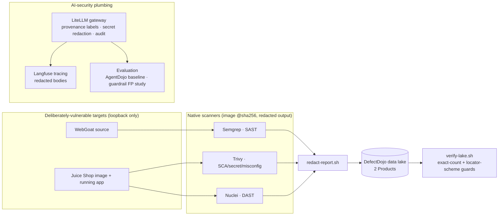

# Project Sentinel — Week‑1 Security Data Lake & AI‑Security Foundation

Project Sentinel (VinUni × VinSOC) is a 12‑week program toward a multi‑agent system
that automates web‑application security testing **and** hardens the AI doing it against
prompt injection and data poisoning. This repository is the **Week‑1 foundation**: a
unified SAST/DAST vulnerability data lake plus the LLM‑security plumbing every later
phase reuses. The autonomous attack/defense agent syndicate is the roadmap, not what is
built here yet — see [Status](#status).

Everything here operates on **deliberately vulnerable, public target apps**
([WebGoat](https://owasp.org/www-project-webgoat/),
[OWASP Juice Shop](https://owasp.org/www-project-juice-shop/)) scanned locally over
loopback behind a fail‑closed allowlist. It is a research/education build, not a product.

## What Week‑1 delivers



- **A unified vulnerability data lake** in [DefectDojo](infra/defectdojo/), holding two
  applications as two Products with intentionally asymmetric coverage
  (see [decision 0007](docs/decisions/0007-a-product-is-one-application-and-benchmarks-leave-the-lake.md)):

  | Product | Coverage today | Scanner |
  |---|---|---|
  | `webgoat` | SAST only | Semgrep (11 findings) |
  | `juice-shop-harness` | DAST + SCA/secret/misconfig | Nuclei (21), Trivy (4) |

  The asymmetry is stated, not hidden: WebGoat has no digest‑pinned runtime yet, so it
  gets no DAST; ZAP has not run this cycle (no local image). Counts are pinned in
  [`infra/defectdojo/lake-baseline.json`](infra/defectdojo/lake-baseline.json) and
  enforced exactly by [`scripts/verify-lake.sh`](scripts/verify-lake.sh).

- **Native scanner → lake pipeline** ([`scanners/`](scanners/), [`scripts/scan-and-import.sh`](scripts/scan-and-import.sh)):
  every scanner image is `@sha256`‑pinned; raw reports are **redacted before import**
  (secret values removed, finding locators preserved); a fail‑closed SSRF allowlist
  constrains every target; and imports only close absent findings when the scan is
  proven to have reached its target.

- **An LLM gateway** ([`infra/litellm/`](infra/litellm/)): a LiteLLM proxy that all model
  calls route through. It **labels provenance and redacts secrets on the egress path,
  and emits an audit trail** — it does **not** claim to detect prompt injection
  ([decision 0006](docs/decisions/0006-the-gateway-labels-provenance-it-does-not-detect-injection.md)).

- **Tracing** ([`infra/langfuse/`](infra/langfuse/)): Langfuse receives redacted request/response bodies.

- **Evaluation** ([`evaluation/`](evaluation/)): a bounded AgentDojo baseline and a
  false‑positive study of the guardrail against real security content.

- **Attack‑surface baseline** ([`attack-surface/`](attack-surface/)): a pinned map of the
  Juice Shop target surface.

- **A benchmark** ([`benchmark/`](benchmark/)): the AI‑SAST measurement (precision/recall
  on OWASP Benchmark) that chose the Week‑1 engine. The scoring corpus lives here, not in
  the lake (decision 0007).

## Repository layout

| Path | What it is |
|---|---|
| `scanners/` | Scanner wrappers, redaction, import; SSRF allowlist. Start at [`scanners/README.md`](scanners/README.md). |
| `scripts/` | Lake orchestration + verification (`scan-and-import.sh`, `verify-lake.sh`), DefectDojo bootstrap. |
| `infra/` | Compose stacks & systemd units: `defectdojo/`, `litellm/`, `langfuse/`, `kong/` (Week‑2 app‑ingress gateway), `rag-store/` (Week‑3 pgvector store), `harness/` (pinned Juice Shop), `systemd/` writers. |
| `rag/` | Week‑3 threat‑intel RAG: ingest, local embeddings, hybrid retrieval, accuracy eval. Start at [`rag/README.md`](rag/README.md). |
| `evaluation/` | AgentDojo baseline + guardrail false‑positive measurement. |
| `attack-surface/` | Juice Shop attack‑surface schema, manifest, baselines. |
| `benchmark/` | AI‑SAST scoring harness, targets, results. |
| `tests/` | Behavioral guards (redaction, SSRF allowlist, close‑decision gate, CI workflow safety). |
| `docs/` | [`WORKFLOW.md`](docs/WORKFLOW.md), [`research-protocol.md`](docs/research-protocol.md) (how an experiment is run here), `product/`, `decisions/`, `journal/`, `plans/`. Map: [`docs/README.md`](docs/README.md). |

## Running the pieces (local)

## Fresh-clone scan-to-redaction (no secrets)

Run this from the repository root. This narrow local proof needs Docker daemon and socket access, `jq`, and public pinned images available to Docker. It needs no DefectDojo credentials, instance, or target-app service. It scans the digest-pinned Juice Shop image and produces
a sanitized local report; it does not import findings or verify the lake.

```bash
(
  set -euo pipefail
  command -v jq >/dev/null || { echo "jq is required for redaction" >&2; exit 1; }
  workspace="$(mktemp -d)"
  trap 'rm -rf "$workspace"' EXIT
  source scanners/image-pins.env
  export IMAGE="$JUICE_SHOP_IMAGE" TRIVY_SCANNERS="secret,misconfig"
  sanitized_report="$(mktemp -t trivy.sanitized.XXXXXX.json)"
  ./scanners/run-trivy.sh "$workspace/trivy.raw.json"
  ./scanners/redact-report.sh trivy "$workspace/trivy.raw.json" "$sanitized_report"
  rm -rf "$workspace"
  trap - EXIT
  printf 'sanitized report: %s\n' "$sanitized_report"
)
```

`TRIVY_SCANNERS=secret,misconfig` avoids the vulnerability database download. The
private workspace is removed immediately after redaction, including the raw report
and its sidecar; the exit trap also cleans it after any failure.

## Provisioned import and verification

Import and `verify-lake.sh` require a separately provisioned DefectDojo instance
and its service credentials; follow [the DefectDojo bring-up guide](infra/defectdojo/README.md)
first. This path does not reproduce the historical baseline from a fresh clone:
that baseline also contains inputs not provisioned by the committed quick-start.

```bash
./scanners/import-report.sh "Trivy Scan" /path/to/trivy.sanitized.json
DD_URL="http://localhost:8080" bash scripts/verify-lake.sh
```

Raw scanner reports are secret‑bearing until redacted — write them to a scratch/ignored
path and never commit one.

## Safety posture

- **Loopback‑only targets** behind a fail‑closed allowlist (`scanners/target-allowlist.sh`);
  DAST redirect/egress containment for Nuclei; a documented `--network host` residual.
- **Redaction is mandatory** on the import path; only sanitized reports are ever stored or uploaded.
- **Public‑repo CI safety** ([`.github/workflows/security-scan.yml`](.github/workflows/security-scan.yml)):
  no fork triggers, SHA‑pinned actions, least privilege, no persisted credentials, no
  lake contact in executable content — enforced by `tests/workflow-safety-test.sh`.
- **Least‑privilege lake access**: the CI service account is non‑admin; the migration
  superuser token was minted for a one‑time migration and revoked afterward.

## Status

**Built (Week‑1):** the data lake, scanner→lake pipeline, LLM gateway (provenance +
redaction + audit), Langfuse tracing, the evaluation baselines, and the Juice Shop
attack‑surface baseline.

**Built (Week‑2):** an [app‑ingress API gateway](infra/kong/) (Kong OSS) fronting the
Juice Shop staging target, with **Agent IAM** — each agent gets a per‑agent OAuth2
client‑credentials identity (short‑TTL token) and is authorized by fail‑closed ACL groups
whose names mirror the Week‑1 attack‑surface auth taxonomy. An agent reaches only the
endpoints its group permits (e.g. public read, *not* the admin route). This app‑ingress
plane is orthogonal to the Week‑1 LLM‑egress gateway
([decision 0008](docs/decisions/0008-kong-fronts-the-app-litellm-fronts-the-model.md)).

**Built (Week‑3):** a self‑hosted [threat‑intelligence RAG pipeline](rag/) — hybrid
retrieval (dense + lexical fused with Reciprocal Rank Fusion) over CVE (NVD), OWASP
guidance, and the local pentest findings, backed by pgvector with local BGE embeddings
(no GPU, no external provider). Ingestion is idempotent and reconciling; retrieval
accuracy is measured against a committed labelled set with a regression guard. GraphRAG is
deferred behind an explicit trigger
([decision 0011](docs/decisions/0011-rag-is-local-embeddings-pgvector-hybrid-graphrag-deferred.md)).

**Built (Week‑4):** the [Recon & Analysis agent](agent/recon.py) — a thin, provenance‑bound
pipeline that fuses the lake, the attack‑surface baseline, and the RAG into a frozen, code‑checked
[Attack Surface Map](agent/schema.py) (aggregates computed by code, not the model, with a
consistency self‑check). One provenance‑labelled LLM call adds a prioritized narrative; every
finding/RAG byte reaches the model labelled `target‑derived`
([decision 0012](docs/decisions/0012-recon-agent-is-a-thin-provenance-bound-pipeline-langgraph-deferred.md)).

**Built (Week‑5):** an [LLM‑guided read‑only fuzzing engine](agent/fuzz.py) — a deterministic
executor with an LLM in the loop. Code selects public read‑only targets, sends the payload corpus
through Kong as `agent‑recon` (the ACL 403s anything else), and flags 5xx/stack‑trace/reflection
signals **by code**; one provenance‑labelled call ranks/mutates. Bounded by a per‑target budget +
kill‑switch; state‑changing payloads are reserved for the Week‑8 HITL gate
([decision 0013](docs/decisions/0013-fuzzing-is-hybrid-read-only-with-deterministic-signals.md)).

**Built (Week‑6):** the [multi‑agent syndicate](agent/supervisor.py) — a hand‑rolled
LangGraph `StateGraph` Supervisor running Recon → map‑guided Fuzz → [Exploit(sim)](agent/exploit.py),
with a durable, **redacted** checkpoint (no raw target text or secrets on disk), a tested
`interrupt()` seam reserved for Week‑8 HITL, and agent‑flow tracing to a loopback‑bound
[Arize Phoenix](infra/phoenix/) plane behind a secret‑AND‑target‑raw span redactor. Model access
stays at the gateway (a model‑egress contract test enforces it). The Exploit agent **proposes,
never executes** — it has no target client (structural containment), its verdict is immutably
`suspected‑needs‑hitl`, and real exploitation is reserved for the Week‑8 HITL gate
([decision 0014](docs/decisions/0014-the-syndicate-is-a-langgraph-supervisor-over-existing-agents-observability-is-a-redaction-gated-phoenix-plane.md)).

**Built (Week‑7):** indirect‑prompt‑injection defense at the one real surface — an attacker‑controlled
scanner finding `title` flowing into the recon analysis. The control is **structural**: the
code‑computed severity/CWE facts a hijacked narrative cannot alter stay authoritative, and a
contradicted analysis is quarantined ([`agent/guard.py`](agent/guard.py)); a heuristic detector plus
a self‑hosted, reproducible [adaptive‑attacker evaluation](evaluation/ipi-guard/) **measure** the
residual (the adaptive loop evades the cheap detector while the structural control holds), with the
false‑positive rate on real security content as the differentiator
([decision 0015](docs/decisions/0015-ipi-defense-is-structural-output-integrity-the-real-surface-is-recon-analysis-detection-is-measured.md)).
A LlamaFirewall air‑gapped sidecar detector is a scoped follow‑up (needs an HF‑license acceptance).

**Built (Week‑8):** a fail‑closed [Human‑in‑the‑Loop approval gate](agent/approval.py) on the
`interrupt()` seam, over a **simulated** state‑changing action. Approval is Ed25519‑signed **out of
the agent's runtime** — the graph holds only the public verify key and has no signer, so a
compromised/prompt‑injected runtime cannot self‑approve; the single‑use token binds the exact
reviewed proposal, is TTL‑bounded, and is audited before the dry‑run. Real state‑changing execution
is **deferred** with its prerequisites named
([decision 0016](docs/decisions/0016-week8-hitl-is-a-failclosed-gate-over-a-simulated-action-with-out-of-process-ed25519-approval-real-execution-deferred.md)).

**Built (Week‑9):** real‑time [PII redaction](agent/pii.py) over a **simulated** (HITL‑approved,
loopback) mock‑user dump. The honest surface finding: the syndicate has no live DB‑dump path (the
Exploit agent never executes, the fuzzer reduces bodies to signal‑kinds, RAG ingests only static
records), so Week‑9 **creates** the surface — a fixture‑backed dry‑run on the Week‑8 seam — and
**scrubs it at capture**, before the dump reaches the checkpoint, the approval‑audit ledger, or the
console. Detection is **narrow deterministic regex** (email, Luhn‑checked card under a label anchor,
JWT, UUID) — Presidio/NER rejected (460 MB model, air‑gapped break, false positives on security
vocabulary) — so the legitimate SQLi/XSS/hash workload passes untouched. The unsalted‑MD5 password
*value* is removed via the existing credential pass while the weak‑hashing *finding* survives. The
residual is **measured** (recall on planted PII, false‑positive on security content) with a
CI regression guard that fails closed on an absent corpus
([decision 0017](docs/decisions/0017-week9-pii-redaction-is-structural-at-capture-measured-not-trusted.md)).

**Built (Week‑10):** a [pentest‑eval pipeline](evaluation/pentest-eval/) whose verdict is a
**deterministic code oracle**, never an LLM. A red‑team found the read‑only fuzzer's observable surface
is exactly one endpoint, so recall over it alone would be vacuous; Week‑10 splits into a `synthetic:true`
oracle corpus with a KNOWN confusion matrix (asserted as independent ground truth) and an enriched real
corpus (the known SQLi search + benign read paths, labelled from public sources) scored over a committed,
**redacted** live capture. The syndicate does identify the observable SQLi (recall 1/1 coverage) and
false‑positives on **zero** benign endpoints (the load‑bearing FP=0 gate); unobservable auth/state‑change
vulns are deferred (0016), never faked. A narrow narrative LLM judge is built only to be **measured** —
under the security‑correct provenance the hardened models refuse the grading role (0/12), so it is
demonstrated unfit to be load‑bearing
([decision 0018](docs/decisions/0018-week10-eval-is-a-deterministic-oracle-over-an-observable-subset-judge-measured-not-trusted.md)).

**Built (Week‑11):** production‑ization scoped honestly to the hardware. Per‑run **FinOps**
([agent/finops.py](agent/finops.py)) MEASURES exact tokens + latency per pentest run and labels cost a
derived estimate (on‑prem = $0), with a deterministic cost/token/latency/error budget guard for
spike alerting — opt‑in and non‑invasive, so Weeks 1–10 are untouched. The syndicate ships as a slim,
digest‑pinned [container](infra/agent/) (RAG degrades gracefully, so no ML stack) verified running the
full pipeline against the live planes. The **on‑prem / air‑gapped** serving path is a gateway alias
(`local‑onprem`) verified **live via Ollama** (`qwen2.5:0.5b` on the 4 GB GPU; an agent provenance‑labelled
call + FinOps at $0), with [vLLM](infra/vllm/) committed as the datacenter path. vLLM production throughput,
autoscaling, and the gateway‑container→host‑model hop (sandbox forbids non‑loopback binds) are deferred
with the constraint named
([decision 0019](docs/decisions/0019-week11-production-is-a-containerised-syndicate-per-run-finops-and-an-on-prem-serving-path.md)).

**Built (Week‑12):** the PRD, business case, and stakeholder handover — scoped to what the project
actually **measured**, not to a pitch. The one honest positioning: Sentinel is **not** "AI finds more"
(every measured AI‑vs‑deterministic contest in the research log ended in the deterministic method winning,
tying, or the question being unanswerable — E13's live run added **zero** findings over the $0 deterministic
path for +$0.05 and +35s). The business case rests on three measured pillars instead — cheap continuous
deterministic detection (+44% recall, free), a bounded, metered AI cost (~$0.05/run), and the
**Security‑FOR‑AI** layer (Agent IAM, provenance gateway, PII redaction, HITL) that offense‑only competitors
lack — and states its ten unmeasured gaps out loud rather than claiming past them
([Week‑12 report](docs/2026-07-26_NguyenManhQuy_Week12.md), VI). ROI is framed as *frequency to close the
gap between costly manual pentests*, never as replacing human judgment.

**Built (research programme):** a written [research protocol](docs/research-protocol.md) governing any
claim that leaves this repo — preregister before measuring, name the *estimand* in the preregistration,
never a bare point estimate, **measure instrument stability before designing around it**, adversarial
review that reproduces before it attacks, and a **correction‑propagation law**: a correction is not done
until the *instrument* is fixed and a test pins it
([decision 0026](docs/decisions/0026-research-claims-are-governed-by-a-written-protocol-and-corrections-must-reach-the-instrument.md)).
Adopted after the branch caught a **retracted claim still executing in committed code**, and immediately
turned on its own results: it demolished one load‑bearing claim, confirmed another, and withdrew two
experiments of its own once `temperature=0` was measured **not** to mean deterministic.

It also produced the first measured place for the model
([decision 0027](docs/decisions/0027-the-llm-belongs-in-the-generative-role-on-absence-of-control-classes.md)):
in the **generative** role on absence‑of‑control classes — where the deterministic engines emit 33 CWE
classes and **none** can express an absent control — the model discriminates those files from clean ones
(p = 0.0078), from merely‑defective ones (p = 0.0003), and from same‑role handlers lacking the defect
(p = 0.020, replicated to 0.001), with transfer confirmed on code written days before measurement.
**Bounds are part of the claim:** sensitivity ~19–22% is a *floor*, file‑level only, one model, one
corpus. The 31 experiments and every correction are in
[`docs/ai-sast-research-log.md`](docs/ai-sast-research-log.md); the synthesis is
[here](docs/plans/reports/2026-07-26-what-this-lab-learned-about-ai-in-security.md).

**Roadmap (later phases):** real state‑changing execution behind the Week‑8 gate (deferred per
decision 0016) and the Week‑7 LlamaFirewall sidecar (both gated on explicit decisions / an HF
license); GraphRAG (deferred per decision 0011); a second, non‑memorised target to test whether the
findings generalise beyond the pinned Juice Shop build.
The full vision and its rationale are in
[`docs/project-sentinel-architecture-proposal.md`](docs/project-sentinel-architecture-proposal.md)
and [`docs/project-understanding-benchmark-to-sentinel.md`](docs/project-understanding-benchmark-to-sentinel.md)
(deep‑dive docs are in Vietnamese). Lasting choices are recorded in
[`docs/decisions/`](docs/decisions/README.md).

No license file is present yet; treat the code as all‑rights‑reserved until one is added.
