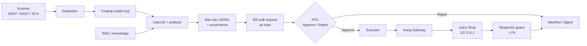

# Project Sentinel

**Sentinel** phân tích bảo mật ứng dụng web **có AI**, trên target lab local (loopback).

Máy quét (SAST / DAST / SCA) tìm và quan sát. Pipeline chuẩn hóa + che secret. AI chỉ giải thích và đề xuất trên **bằng chứng đã typed** — không bịa endpoint hay lỗ hổng. Mọi request state-changing đi qua **HITL → API Gateway → catalog cố định**.

Site mentor: [vinsoc.manhquy.io.vn](https://vinsoc.manhquy.io.vn) · [vinsoc.manhquy.id.vn](https://vinsoc.manhquy.id.vn) · [`/llms.txt`](https://vinsoc.manhquy.io.vn/llms.txt)

### Bản deploy live (3 địa chỉ — đừng nhầm vai trò)

| URL | Là gì | Đăng nhập |
|---|---|---|
| `vinsoc.manhquy.io.vn` (+ `.id.vn`) | **Site tài liệu** — báo cáo tuần, kiến trúc, demo. Đọc công khai. | Không |
| `app.vinsoc.manhquy.io.vn` | **DefectDojo** — nền tảng quản lý lỗ hổng mã nguồn mở (OWASP), hiển thị các finding mà scanner đã quét từ Juice Shop. **Đây là công cụ có sẵn Sentinel đổ finding vào, KHÔNG phải web UI riêng của Sentinel.** | Cloudflare Access (OTP email) → login DefectDojo (`admin`) |
| repo trên máy | **Nơi "test dự án" đúng nghĩa** — luồng quét → agent → HITL → gateway → guardrail (CLI/scripts + JSONL), không phải web. | Chạy local |

"Sản phẩm Sentinel" là **pipeline** (scanner → chuẩn hóa → agent bám bằng chứng → HITL → Kong → guardrail), chạy bằng script + báo cáo JSONL — **không có web UI bespoke**. `app.vinsoc` chỉ là bề mặt xem finding (DefectDojo). Hướng dẫn dùng đầy đủ: [`docs/operations/live-deployment-guide.md`](docs/operations/live-deployment-guide.md).

---

## Vấn đề

Kết quả quét bảo mật nhiều tool, khó triage. Đưa LLM “đọc giúp” mà không rào thì dễ:

- bịa finding / endpoint
- làm theo chỉ dẫn độc trong response (prompt injection)
- rò secret / PII vào prompt và log

## Cách Sentinel xử lý

| Vai trò | Ai làm |
|---|---|
| Tìm / quan sát | Scanner deterministic (Semgrep, Trivy, Nuclei, …) |
| Chuẩn hóa + che secret | Pipeline `scanners/` + adapter |
| Giải thích / đề xuất | Agent + renderer — model **không invent fact** |
| Hành động trên target | Chỉ sau HITL + Kong + allowlist/catalog |

---

## Luồng hoạt động (Charter)



1. **Quét** target lab → report thô  
2. **Redact** secret trước khi lưu / đưa vào agent  
3. **Chuẩn hóa** findings + (tuỳ chọn) grounding RAG offline  
4. **Phân tích** → JSONL evidence-bound (field typed; prose không invent fact)  
5. **Đề xuất** request từ catalog an toàn cố định  
6. **HITL** approve/reject  
7. **Gửi** qua Kong → target → guard response → ghi evidence (digest, không raw body vào LLM)

Chi tiết ranh giới tin cậy: [as-built](docs/sentinel-six-week-as-built-architecture.md) · [charter brief](docs/product/sentinel-charter-brief.md)

---

## Hai product

Repo có **hai product**; không trộn bằng chứng.

| | **Charter** | **Workbench** |
|---|---|---|
| Làm gì | Luồng quét → báo cáo → HITL → 1 request catalog qua Kong | UI/broker research local, fixture scanner, corpus host-local |
| Target | Juice Shop `http://127.0.0.1:13000` | Không kế thừa target/HITL/evidence Charter |
| Authority | [charter brief](docs/product/sentinel-charter-brief.md) | [workbench brief](docs/product/sentinel-security-research-workbench.md) |

---

## Chạy nhanh

### Mentor / grader (chạy lại test & eval Tuần 5–6)

Cần `python3` (nếu thiếu `.venv/bin/pip`, cài `python3-venv` / `ensurepip` rồi dừng). Không `source infra/.env`. Không `pip install -r rag/requirements.txt`. Không chạy `python3 -m pip` / `python3 -m pytest` trên host. Bare `pytest` không phải bài chấm. Chạy từ thư mục gốc repo:

```bash
python3 -m venv .venv
.venv/bin/pip install -r requirements.txt
.venv/bin/python -m pytest tests/test_week5_labeled_redaction.py tests/test_charter_requests.py tests/test_week5_demo_facade.py -q
.venv/bin/python evaluation/pii-redaction/measure.py
PYTHON=.venv/bin/python bash tests/week5-demo-facade-test.sh
```

### Proof: quét → che secret (không cần lake / LLM)

Cần Docker, `jq`, image pin public.

```bash
(
  set -euo pipefail
  command -v jq >/dev/null || { echo "jq is required" >&2; exit 1; }
  workspace="$(mktemp -d)"
  trap 'rm -rf "$workspace"' EXIT
  source scanners/image-pins.env
  export IMAGE="$JUICE_SHOP_IMAGE" TRIVY_SCANNERS="secret,misconfig"
  sanitized_report="$(mktemp -t trivy.sanitized.XXXXXX.json)"
  ./scanners/run-trivy.sh "$workspace/trivy.raw.json"
  ./scanners/redact-report.sh trivy "$workspace/trivy.raw.json" "$sanitized_report"
  rm -rf "$workspace"
  trap - EXIT
  printf 'sanitized report: %s\n' "$sanitized_report"
)
```

### Charter (live, operator)

```bash
bash scripts/sentinel-live-preflight.sh
bash scripts/sentinel-charter-up.sh          # bật topology; không phải 1 lần chạy Charter
SENTINEL_PYTHON=.venv/bin/python bash scripts/sentinel-demo.sh run --profile charter --run-id demo
```

`run` / `resume` cần credential provider + material Kong / approval trên máy operator.  
Runbook: [live acceptance](docs/operations/sentinel-live-acceptance-runbook.md)

Cửa nộp: khối mentor/grader phía trên, lệnh `run` này, và trang `/demo/charter/`
(kể bảy bước + hai bản ghi). Kịch bản nói 15 phút là tài liệu cá nhân trên máy
operator, không nằm trong git.
Link [live acceptance](docs/operations/sentinel-live-acceptance-runbook.md) là
đường operator-gated (Kong / approve / send).
`scripts/sentinel-demo.sh` mặc định `rag/.venv/bin/python`; venv grader ở đây là
`.venv` nên đặt `SENTINEL_PYTHON=.venv/bin/python`.
Walkthrough trên site không phải lần chạy CLI live.

### Workbench (riêng)

```bash
bash scripts/workbench-up.sh
```

Demo: [workbench demo](docs/operations/sentinel-workbench-demo.md)

---

## Fresh-clone scan-to-redaction (no secrets)

Run this from the repository root. This local proof needs Docker daemon and socket access, `jq`, and public pinned images available to Docker. It needs no DefectDojo credentials, instance, or target-app service. It scans a digest-pinned image and writes only the sanitized
report outside the private workspace; it does not import findings or verify a lake.

```bash
(
  set -euo pipefail
  command -v jq >/dev/null || { echo "jq is required for redaction" >&2; exit 1; }
  workspace="$(mktemp -d)"
  trap 'rm -rf "$workspace"' EXIT
  source scanners/image-pins.env
  export IMAGE="$JUICE_SHOP_IMAGE" TRIVY_SCANNERS="secret,misconfig"
  sanitized_report="$(mktemp -t trivy.sanitized.XXXXXX.json)"
  ./scanners/run-trivy.sh "$workspace/trivy.raw.json"
  ./scanners/redact-report.sh trivy "$workspace/trivy.raw.json" "$sanitized_report"
  rm -rf "$workspace"
  trap - EXIT
  printf 'sanitized report: %s\n' "$sanitized_report"
)
```

`TRIVY_SCANNERS=secret,misconfig` avoids the vulnerability database download. The
private raw report and status sidecar are removed immediately after redaction; the
exit trap also cleans them after any failure.

Provisioned import and verification of the DefectDojo lake are separate operations.
A fresh clone of the committed repository does not reproduce the historical baseline.

## Cấu trúc repo (điểm vào)

| Path | Vai trò |
|---|---|
| [`scanners/`](scanners/README.md) | Chạy scanner, redaction, allowlist target |
| [`agent/`](agent/) | Normalize, recon, proposal, HITL, response guard |
| [`rag/`](rag/README.md) | Kho tri thức local |
| [`infra/kong/`](infra/kong/README.md) | Gateway + ACL + audit |
| [`scripts/sentinel-demo.sh`](scripts/sentinel-demo.sh) | Controller chạy Charter |
| [`docs/`](docs/README.md) | Bản đồ tài liệu, decisions, runbook |
| [`docs/reports/`](docs/reports/index.md) | Báo cáo tuần · site `website/` |
| [`scanners/image-pins.env`](scanners/image-pins.env) | Pin image (không secret) |

---

## Ranh giới an toàn (tóm tắt)

- Target chỉ loopback lab; redirect / target ngoài bị từ chối  
- Nội dung từ scanner & target = **untrusted data**, không phải instruction cho model  
- Request chủ động chỉ catalog predeclared qua Kong; POST cần HITL  
- Không commit secret, raw scan, `infra/.env`

---

## Tài liệu

- Bản đồ docs: [docs/README.md](docs/README.md)  
- As-built: [docs/sentinel-six-week-as-built-architecture.md](docs/sentinel-six-week-as-built-architecture.md)  
- Decisions: [docs/decisions/](docs/decisions/)  
- Agent workflow: [docs/WORKFLOW.md](docs/WORKFLOW.md) · [AGENTS.md](AGENTS.md)
