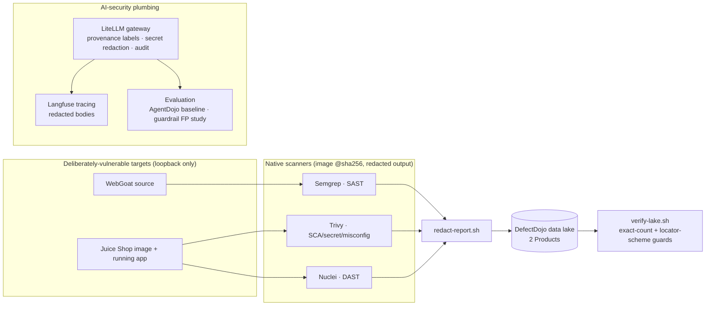

# Project Sentinel — Week‑1 Security Data Lake & AI‑Security Foundation

Project Sentinel (VinUni × VinSOC) is a 12‑week program toward a multi‑agent system
that automates web‑application security testing **and** hardens the AI doing it against
prompt injection and data poisoning. This repository is the **Week‑1 foundation**: a
unified SAST/DAST vulnerability data lake plus the LLM‑security plumbing every later
phase reuses. The autonomous attack/defense agent syndicate is the roadmap, not what is
built here yet — see [Status](#status).

Everything here operates on **deliberately vulnerable, public target apps**
([WebGoat](https://owasp.org/www-project-webgoat/),
[OWASP Juice Shop](https://owasp.org/www-project-juice-shop/)) scanned locally over
loopback behind a fail‑closed allowlist. It is a research/education build, not a product.

## What Week‑1 delivers



- **A unified vulnerability data lake** in [DefectDojo](infra/defectdojo/), holding two
  applications as two Products with intentionally asymmetric coverage
  (see [decision 0007](docs/decisions/0007-a-product-is-one-application-and-benchmarks-leave-the-lake.md)):

  | Product | Coverage today | Scanner |
  |---|---|---|
  | `webgoat` | SAST only | Semgrep (11 findings) |
  | `juice-shop-harness` | DAST + SCA/secret/misconfig | Nuclei (21), Trivy (4) |

  The asymmetry is stated, not hidden: WebGoat has no digest‑pinned runtime yet, so it
  gets no DAST; ZAP has not run this cycle (no local image). Counts are pinned in
  [`infra/defectdojo/lake-baseline.json`](infra/defectdojo/lake-baseline.json) and
  enforced exactly by [`scripts/verify-lake.sh`](scripts/verify-lake.sh).

- **Native scanner → lake pipeline** ([`scanners/`](scanners/), [`scripts/scan-and-import.sh`](scripts/scan-and-import.sh)):
  every scanner image is `@sha256`‑pinned; raw reports are **redacted before import**
  (secret values removed, finding locators preserved); a fail‑closed SSRF allowlist
  constrains every target; and imports only close absent findings when the scan is
  proven to have reached its target.

- **An LLM gateway** ([`infra/litellm/`](infra/litellm/)): a LiteLLM proxy that all model
  calls route through. It **labels provenance and redacts secrets on the egress path,
  and emits an audit trail** — it does **not** claim to detect prompt injection
  ([decision 0006](docs/decisions/0006-the-gateway-labels-provenance-it-does-not-detect-injection.md)).

- **Tracing** ([`infra/langfuse/`](infra/langfuse/)): Langfuse receives redacted request/response bodies.

- **Evaluation** ([`evaluation/`](evaluation/)): a bounded AgentDojo baseline and a
  false‑positive study of the guardrail against real security content.

- **Attack‑surface baseline** ([`attack-surface/`](attack-surface/)): a pinned map of the
  Juice Shop target surface.

- **A benchmark** ([`benchmark/`](benchmark/)): the AI‑SAST measurement (precision/recall
  on OWASP Benchmark) that chose the Week‑1 engine. The scoring corpus lives here, not in
  the lake (decision 0007).

## Repository layout

| Path | What it is |
|---|---|
| `scanners/` | Scanner wrappers, redaction, import; SSRF allowlist. Start at [`scanners/README.md`](scanners/README.md). |
| `scripts/` | Lake orchestration + verification (`scan-and-import.sh`, `verify-lake.sh`), DefectDojo bootstrap. |
| `infra/` | Compose stacks & systemd units: `defectdojo/`, `litellm/`, `langfuse/`, `harness/` (pinned Juice Shop), `systemd/` writers. |
| `evaluation/` | AgentDojo baseline + guardrail false‑positive measurement. |
| `attack-surface/` | Juice Shop attack‑surface schema, manifest, baselines. |
| `benchmark/` | AI‑SAST scoring harness, targets, results. |
| `tests/` | Behavioral guards (redaction, SSRF allowlist, close‑decision gate, CI workflow safety). |
| `docs/` | [`WORKFLOW.md`](docs/WORKFLOW.md), `product/`, `decisions/`, `journal/`, `plans/`. Map: [`docs/README.md`](docs/README.md). |

## Running the pieces (local)

Prerequisites: Docker + Docker Compose, `python3`, and the DefectDojo stack up. Scanner
and DefectDojo credentials come from a git‑ignored `infra/.env` (never committed).

```bash
# 1. Bring up the pinned Juice Shop harness (published only on 127.0.0.1:13000)
docker compose -f infra/harness/juice-shop.compose.yml up -d

# 2. Run a scanner → redact → import (example: Trivy)
export ALLOWLIST="127.0.0.1:13000" TARGET_URL="http://127.0.0.1:13000"
cd scanners && ./run-trivy.sh /tmp/trivy.json \
  && ./redact-report.sh trivy /tmp/trivy.json /tmp/trivy.san.json \
  && ./import-report.sh "Trivy Scan" /tmp/trivy.san.json

# 3. Verify the lake matches its pinned baseline (read-only)
DD_URL="http://localhost:8080" bash scripts/verify-lake.sh
```

Raw scanner reports are secret‑bearing until redacted — write them to a scratch/ignored
path and never commit one.

## Safety posture

- **Loopback‑only targets** behind a fail‑closed allowlist (`scanners/target-allowlist.sh`);
  DAST redirect/egress containment for Nuclei; a documented `--network host` residual.
- **Redaction is mandatory** on the import path; only sanitized reports are ever stored or uploaded.
- **Public‑repo CI safety** ([`.github/workflows/security-scan.yml`](.github/workflows/security-scan.yml)):
  no fork triggers, SHA‑pinned actions, least privilege, no persisted credentials, no
  lake contact in executable content — enforced by `tests/workflow-safety-test.sh`.
- **Least‑privilege lake access**: the CI service account is non‑admin; the migration
  superuser token was minted for a one‑time migration and revoked afterward.

## Status

**Built (Week‑1):** the data lake, scanner→lake pipeline, LLM gateway (provenance +
redaction + audit), Langfuse tracing, the evaluation baselines, and the Juice Shop
attack‑surface baseline.

**Roadmap (later phases, not in this repo):** the multi‑agent recon/fuzz/exploit
syndicate, human‑in‑the‑loop gating, threat‑intel RAG, and self‑hosted vLLM serving.
The full vision and its rationale are in
[`docs/project-sentinel-architecture-proposal.md`](docs/project-sentinel-architecture-proposal.md)
and [`docs/project-understanding-benchmark-to-sentinel.md`](docs/project-understanding-benchmark-to-sentinel.md)
(deep‑dive docs are in Vietnamese). Lasting choices are recorded in
[`docs/decisions/`](docs/decisions/README.md).

No license file is present yet; treat the code as all‑rights‑reserved until one is added.
