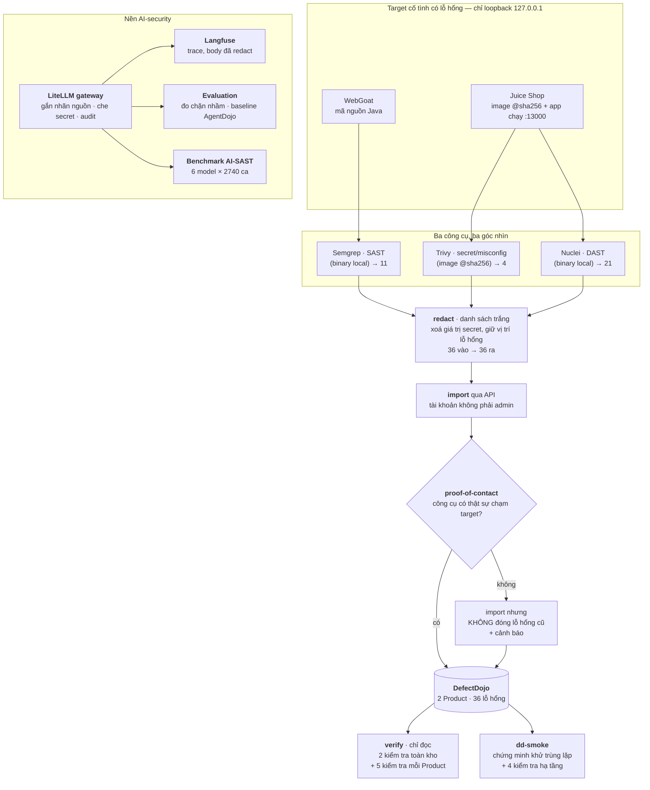

# Báo cáo Tuần 1 — Project Sentinel (VinUni × VinSOC)

- Họ và tên: Nguyễn Mạnh Quý
- Tuần: 1
- Ngày: 2026-07-24
- Phạm vi: đây là báo cáo **giai đoạn nền (Tuần 1)**. Các giai đoạn sau đã có code trên
  nhánh `main` và sẽ được báo cáo riêng.

---

## 0. Tóm tắt nhanh

Tuần 1 không xây hệ multi-agent. Tuần 1 xây **cái nền** cho 12 tuần, gồm hai nửa:

| Nửa | Làm gì | Kết quả đo được |
|---|---|---|
| **A. Kho lỗ hổng** | Gom kết quả nhiều công cụ quét bảo mật về một chỗ, không đếm trùng | 3 công cụ, **36 lỗ hổng**, qua **7 bước kiểm tra** đều khớp |
| **B. Nền AI-security** | Đường ống để sau này AI làm việc này mà không bị lừa | Gateway + tracing + **2 phép đo baseline** |
| **C. Benchmark chọn model** | Đo xem model nào đọc code bắt lỗi tốt nhất | 6 model × 2740 ca kiểm thử, chọn được `cx/gpt-5.6-sol` |

Tất cả chạy trên máy local, chỉ trên `127.0.0.1`, sau một danh sách cho phép chặn mặc
định. Đây là bản nghiên cứu và học, không phải sản phẩm.

**Ba điều em muốn mentor chú ý nhất:**

1. Em không chỉ chạy công cụ — em xây **hai chốt an toàn** để phát hiện khi chính hệ
   thống của mình báo cáo sai (mục 2.3), và **7 bước kiểm tra** để chứng minh kho đúng
   (mục 2.5).
2. Phần AI-security được **đo**, không chỉ được cấu hình — có hai baseline chạy thật
   (mục 3.3).
3. Em **tự tìm ra và ghi lại** những chỗ mình làm sai, kể cả những "bài kiểm tra không
   bao giờ trượt được" (mục 6).

---

## 1. Bài toán

Chương trình 12 tuần này hướng tới một hệ nhiều agent tự động kiểm thử bảo mật web.
Nhưng có hai vấn đề phải giải trước:

**Vấn đề 1 — Kết quả quét bị phân mảnh.** Mỗi công cụ bảo mật nhìn ứng dụng từ một góc
khác nhau và xuất ra một định dạng khác nhau. Chạy lại nhiều lần thì kết quả trùng nhau.
Không có chỗ nhìn toàn cảnh, cũng không biết lỗi nào là mới, lỗi nào đã có từ trước.

**Vấn đề 2 — Nếu để AI làm việc này, chính AI trở thành bề mặt tấn công.** AI đọc mã
nguồn và kết quả quét của ứng dụng có lỗ hổng. Kẻ tấn công có thể nhét lệnh vào chính nội
dung đó để lừa AI (gọi là *prompt injection* — tiêm lệnh gián tiếp). Nên phải có sẵn
đường ống ghi nhãn "dữ liệu này đến từ đâu" ngay từ đầu.

Tuần 1 giải phần nền của cả hai, chạy trên hai ứng dụng cố tình có lỗ hổng do OWASP phát
hành: **WebGoat** (mã nguồn Java) và **OWASP Juice Shop** (ứng dụng web chạy thật).

---

## 2. Phần A — Kho tổng hợp lỗ hổng

### 2.1. Ba công cụ, ba góc nhìn

Ý chính: **không tin vào một công cụ duy nhất**. Mỗi công cụ chỉ thấy được một loại lỗi.

| Công cụ | Cách nó nhìn | Ví dụ lỗi nó bắt được | Cái nó **không** thấy |
|---|---|---|---|
| **Semgrep** (SAST) | Đọc mã nguồn tĩnh, không cần chạy app | Dùng hàm sinh số ngẫu nhiên yếu, dùng thuật toán băm yếu | Lỗi chỉ lộ ra khi app chạy |
| **Trivy** | Đọc image Docker và file cấu hình | Mật khẩu/khoá bị viết cứng trong code, cấu hình sai | Lỗi logic trong mã nguồn |
| **Nuclei** (DAST) | Gửi request vào app đang chạy thật | Thiếu security header, lộ endpoint nội bộ | Lỗi nằm sâu trong code chưa được gọi tới |

> **SAST** = Static Application Security Testing — kiểm thử tĩnh, đọc code như đọc sách.
> **DAST** = Dynamic — kiểm thử động, gõ cửa app thật xem nó phản ứng ra sao.

Vì mỗi công cụ xuất một định dạng riêng và chạy lại nhiều lần thì trùng nhau, cần một chỗ
gom chung. Em dùng **DefectDojo** — một hệ quản lý lỗ hổng mã nguồn mở, biết đọc định
dạng của cả ba công cụ và tự khử trùng lặp.

Kho chia thành 2 **Product**, mỗi Product là **một ứng dụng**:

| Product | Đang có | Vì sao chỉ có bấy nhiêu |
|---|---|---|
| `webgoat` | Chỉ SAST (Semgrep) | Chưa có bản chạy được ghim phiên bản, nên chưa quét động được |
| `juice-shop-harness` | DAST + secret/misconfig | Có image ghim `@sha256` và app chạy thật trên `127.0.0.1:13000` |

Sự bất đối xứng này là **cố ý và được khai báo**, không phải bỏ sót — ghi trong
`docs/decisions/0007`.

### 2.2. Luồng chạy một lần quét: 4 bước

```
  scan  ──▶  redact  ──▶  import  ──▶  verify
 (quét)     (che secret)   (đẩy vào kho)  (đối chiếu)
```

**Bước 1 — scan (quét).**
Trước khi quét, target phải nằm trong danh sách cho phép. Danh sách này **chặn mặc
định**: cái gì không được khai báo rõ ràng thì bị từ chối, chỉ `127.0.0.1` mới qua được.
Việc này chặn kiểu tấn công SSRF — lừa hệ thống tự đi quét một địa chỉ nội bộ nào đó.

**Bước 2 — redact (che dữ liệu nhạy cảm).**
Report thô có chứa giá trị secret thật. Bước này **xoá giá trị nhưng giữ nguyên vị trí
lỗi**.

Chi tiết này quan trọng và dễ làm sai: DefectDojo dựa vào *vị trí* (file nào, dòng nào,
luật nào) để biết lỗi này đã có rồi hay chưa. Nếu xoá luôn cả vị trí thì mỗi lần quét
lại, DefectDojo sẽ tưởng đây là lỗi hoàn toàn mới → số lỗi phình lên vô hạn.

Nói ngắn: **xoá cái nhạy cảm, giữ cái để nhận dạng.**

**Và đây là chỗ em làm sai lần đầu, phải viết lại sau code review.** Bản đầu dùng *danh
sách đen*: liệt kê những trường biết là có chứa secret rồi xoá chúng đi. Cách này rò rỉ
qua mọi trường **chưa được liệt kê** — `evidence`/`otherinfo` của ZAP, `curl-command` của
Nuclei, `message`/`fix`/`dataflow_trace` của Semgrep, phần `code` của Trivy misconfig.

Bản hiện tại làm ngược lại — *danh sách trắng*: **chỉ giữ đúng những trường DefectDojo
cần để phân tích và khử trùng lặp, còn lại bỏ hết.** Khác biệt then chốt: khi công cụ
thượng nguồn thêm một trường mới có chứa secret, cách cũ **giữ lại theo mặc định**, cách
mới **bỏ đi theo mặc định**.

**Bước 3 — import (đẩy vào kho).**
Đẩy qua API của DefectDojo, dùng tài khoản riêng **không phải admin**.

**Bước 4 — verify (đối chiếu).**
Chi tiết ở mục 2.5.

### 2.3. Hai chốt an toàn — phần em muốn nói kỹ nhất

Đây là chỗ phân biệt giữa "chạy công cụ" và "xây hệ thống đáng tin".

#### Chốt 1 — proof-of-contact: *"chứng minh là mày có quét thật"*

**Kịch bản hỏng mà chốt này chặn:**

> Em trỏ nhầm đường dẫn → Semgrep quét đúng 0 file → trả về 0 lỗi → hệ thống hiểu là
> "không còn lỗi nào" → **đóng sạch toàn bộ lỗi cũ trong baseline** → mọi thứ báo xanh,
> trong khi thực tế chưa có gì được sửa.

Đây là kiểu hỏng nguy hiểm nhất, vì nó **không báo lỗi** — nó báo thành công.

**Cách chặn:** mỗi công cụ phải xuất ra một file bằng chứng đã thực sự chạm vào target.
Chỉ khi bằng chứng đó hợp lệ, hệ thống mới được phép đóng các lỗi cũ.

```json
// scanners/out/semgrep.json.status.json — bằng chứng thật, sinh ra từ lần chạy thật
{"tool": "semgrep", "status": "ok", "exit": 0, "reported": 11,
 "contact_proven": true, "detail": "scanned 296 files, 0 errors"}
```

296 file — con số này là bằng chứng. Nếu nó về 0, hệ thống vẫn import nhưng **từ chối
đóng lỗi cũ** và cảnh báo.

#### Chốt 2 — verify so khớp *chính xác*, không cho sai số

Logic: target Juice Shop được ghim bằng digest `@sha256`, bộ luật Semgrep được ghim bằng
checksum SHA-256. Cả hai đều không thể tự đổi.

⇒ Số lỗ hổng về mặt lý thuyết **không thể tự thay đổi**.
⇒ Nếu nó đổi, tức là có gì đó hỏng — không phải "sai số chấp nhận được".

Vì vậy bước verify so khớp đúng bằng số, không có ngưỡng dung sai.

### 2.4. Quét ra bao nhiêu lỗ hổng

#### 2.4.1. Số lỗ hổng đi qua từng chặng

Câu hỏi quan trọng: **bước che dữ liệu có làm mất lỗ hổng nào không?** Câu trả lời là
không, và đây là bằng chứng — số đếm ở cả bốn chặng đều bằng nhau:

| Công cụ | ① Báo cáo thô | ② Sau khi che | ③ Nhập vào kho | ④ Ghim trong baseline |
|---|---|---|---|---|
| Semgrep | **11** (0 lỗi engine) | 11 | 11 | 11 |
| Trivy | **4** (đều là Secrets) | 4 | 4 | 4 |
| Nuclei | **21** | 21 | 21 | 21 |
| **Tổng** | **36** | **36** | **36** | **36** |

Nguyên tắc: **bước che xoá *giá trị*, không xoá *lỗ hổng*.** Số lượng không đổi, nhưng
dung lượng file giảm rất mạnh — đó chính là phần dữ liệu nhạy cảm bị loại bỏ:

| File báo cáo | Thô → sau khi che | Tỉ lệ thu nhỏ |
|---|---|---|
| `trivy.json` | 636 KB → 2,2 KB | **282×** |
| `nuclei.jsonl` | 220 KB → 10,4 KB | **21×** |
| `semgrep.json` | 48,7 KB → 7,7 KB | **6,4×** |

Trivy thu nhỏ nhiều nhất vì báo cáo thô của nó chứa cả **nội dung dòng code** quanh mỗi
secret — chính là thứ nguy hiểm nhất phải bỏ đi.

#### 2.4.2. Chi tiết 36 lỗ hổng — Bảng 1

| Công cụ | Loại | Target | Cách chạy | Tổng | Crit | High | Med | Info | Lỗ hổng tiêu biểu |
|---|---|---|---|---|---|---|---|---|---|
| Semgrep | SAST | WebGoat source (296 file Java) | binary local, v1.171.0 | 11 | 0 | 0 | 0 | 11¹ | 10 lỗi sinh số ngẫu nhiên yếu (CWE-330), 1 lỗi băm yếu (CWE-327) |
| Trivy | secret / misconfig | Juice Shop image `@sha256:e681447…` | image ghim `@sha256:cffe3f5…` | 4 | 0 | 2 | 2 | 0 | 2 private key (HIGH), 2 JWT token (MEDIUM) |
| Nuclei | DAST | `http://127.0.0.1:13000` | binary local | 21 | 0 | 0 | 1 | 20 | 1 lỗi lộ Prometheus metrics (MED, CWE-200); 20 lỗi INFO gồm thiếu 7 security-header, tech-detect, robots/security.txt, lộ Swagger API |
| **Tổng** | | | | **36** | **0** | **2** | **3** | **31** | |

¹ Semgrep xếp cả 11 lỗi ở mức "WARNING" trong nội bộ nó; khi vào DefectDojo thì ánh xạ
sang mức non-critical.

**Về cột "cách chạy" — một điểm em phải nói rõ.** Thiết kế ban đầu là mọi công cụ đều
chạy từ Docker image ghim `@sha256`. Thực tế chỉ **Trivy** làm được. Registry Docker trên
máy này tải các layer lớn liên tục timeout: ZAP (~1,6 GB) đứng 40 phút không nhúc nhích,
Nuclei và Semgrep chết ở layer cuối. Nên Semgrep được cài từ PyPI và Nuclei tải binary từ
GitHub release, cả hai chạy local. Đây là **đánh đổi có chủ ý, được ghi lại** trong
`docs/decisions/0005`, không phải bỏ qua yêu cầu. Target Juice Shop thì vẫn ghim digest
đầy đủ.

**Bốn điểm cần nói thẳng về kết quả:**

- **Semgrep ra 11, không phải 221.** Lần chạy đầu trên corpus benchmark ra 221 findings.
  Nhưng đó là **corpus khác** (OWASP Benchmark), không phải WebGoat. Sau khi chuẩn hoá lại
  theo nguyên tắc "một Product là một ứng dụng" và tách corpus benchmark ra khỏi kho
  (decision 0007), baseline của WebGoat còn 11. Đây là **đổi phạm vi**, không phải lọc bớt
  kết quả. Ngày 2026-07-24 em sửa lại 11 finding này để đổi đường dẫn tuyệt đối (đang lộ
  username và tên máy) thành đường dẫn tương đối.
- **Trivy chưa quét được CVE.** Lúc tải database lỗ hổng thì timeout, nên chỉ chạy được
  phần `secret` và `misconfig` — cả 4 lỗ hổng tìm được đều thuộc loại Secrets. Phần SCA
  (rà thư viện phụ thuộc, đối chiếu CVE) chưa có kết quả.
- **Nuclei phần lớn là INFO** — 20/21. DAST ở đây mới bắt các lỗi hạ tầng và header, chưa
  khai thác các endpoint lỗi cố ý của Juice Shop.
- **ZAP chưa chạy live.** Em đã đấu nối xong và sửa phần redaction để sau này import
  được, nhưng chưa kéo được image trong đợt này.

### 2.5. Validate như thế nào — 7 bước kiểm tra

Bước `verify` không phải chỉ "đếm lại số lỗi". Script `scripts/verify-lake.sh` chạy **7
kiểm tra**, và toàn bộ đều **chặn mặc định** — không kiểm chứng được thì coi là trượt,
không phải bỏ qua.

Script này **chỉ đọc, không bao giờ ghi** vào kho. Nhờ vậy nó chạy độc lập lúc nào cũng
được, và không thể tự làm sai lệch thứ nó đang kiểm tra.

#### Nhóm 1 — Hai kiểm tra toàn kho (chạy trước, một lần)

Lý do phải có nhóm này: **một baseline chỉ nhìn được những gì nó được bảo là hãy nhìn.**
Nếu chỉ kiểm tra từng Product có tên trong baseline, thì một Product lạ nằm trong kho sẽ
không ai đụng tới.

| # | Kiểm tra | Bắt được lỗi gì |
|---|---|---|
| **L1** | Mọi Product **đang tồn tại** trong DefectDojo đều phải có tên trong baseline | Trôi dạt **do bỏ sót**: một Product có thật mà không ai mô tả thì cũng nguy hiểm ngang một số đếm sai |
| **L2** | Không lỗ hổng active nào trong **toàn bộ kho** được trỏ vào corpus chấm điểm | Dữ liệu benchmark lẫn vào kho ứng dụng thật (decision 0007). Quét toàn instance nên bắt được cả corpus nấp trong Product không ai khai báo |

#### Nhóm 2 — Năm kiểm tra cho từng Product

| # | Kiểm tra | Bắt được lỗi gì |
|---|---|---|
| **0** | Product có tên trong baseline **phải tồn tại thật** | Baseline gọi tên một Product chưa ai tạo — đó là trôi dạt, không phải "kết quả rỗng bỏ qua được" |
| **1** | Engagement đúng tên phải tồn tại, **VÀ không có engagement nào khác** trong Product đó | Vì `auto_create_context=true`, gõ sai tên engagement sẽ **âm thầm tạo ra một engagement anh em**. Lỗ hổng nằm trong đó thì không ai kiểm tra. Sự tồn tại của nó đã là trôi dạt |
| **2** | Engagement chứa **đúng** các loại scan mà baseline liệt kê — không thiếu nguồn, không thừa test lạ | Một nguồn quét chết âm thầm, hoặc một test lạ được thêm vào |
| **3** | Mỗi nguồn: số lỗ hổng **active, không trùng lặp** phải bằng baseline **chính xác** | Bất kỳ thay đổi nào. Target ghim digest, bộ luật ghim checksum ⇒ số không thể tự đổi ⇒ đổi là hỏng |
| **4** | Lần import gần nhất **không cũ hơn 36 giờ** | Đường ống chết âm thầm: kho vẫn đúng số nhưng đã ngừng cập nhật từ lâu |

**Về ngưỡng 36 giờ ở kiểm tra số 4.** Bộ hẹn giờ systemd chạy hai writer mỗi ngày, có
thêm độ trễ ngẫu nhiên tối đa 1 giờ — nên hai lần import liên tiếp có thể cách nhau tới
~25 giờ một cách hợp lệ. Ngưỡng 36 giờ (gấp 1,5 lần nhịp ngày) hấp thụ được dao động đó,
nhưng **vẫn trượt nếu bỏ lỡ trọn một ngày** — đúng cái mà kiểm tra này sinh ra để bắt.

Và ngưỡng này **mặc định là lỗi nghiêm trọng**, không phải cảnh báo. Nguyên tắc:
**một kiểm tra không bao giờ có thể kích hoạt thì không phải một kiểm tra.**

#### Nhóm 3 — Kiểm tra khử trùng lặp, tách riêng

Tính chất "nhập cùng một lỗ hổng hai lần thì kho không phình lên" được chứng minh **bằng
hành vi thật** trong `scripts/dd-smoke.sh`, không chứng minh lại trong `verify-lake.sh`.

Lý do tách ra rất cụ thể: muốn chứng minh bằng cách nhập lại thì phải **ghi** vào kho — mà
một bước tên là "verify" thì tuyệt đối không được ghi.

`dd-smoke.sh` kiểm tra 5 điều, đều là những thứ có thể "trông như đang chạy" mà thật ra
hỏng:

- Token CI xác thực được **và** chỉ có quyền trên đúng một Product
- `DD_DEBUG` đã tắt, và không khoá mã hoá nào còn để giá trị mặc định công khai
- Kết nối cơ sở dữ liệu **thật sự là TLS**, và kết nối không mã hoá bị từ chối
- **Cả hai** từ điển khử trùng lặp parse được, **và mọi khoá đều trỏ tới một loại scan đã
  đăng ký** — vì gõ sai một khoá sẽ âm thầm rơi về parser mặc định, đúng cái lỗi mà kiểm
  tra này tồn tại để bắt
- Một lần import bất đồng bộ phải **đạt trạng thái cuối** trước khi khẳng định bất cứ điều
  gì về nó

#### Tóm lại

| Câu hỏi | Trả lời |
|---|---|
| Quét ra bao nhiêu lỗ hổng? | **36** — Semgrep 11, Trivy 4, Nuclei 21 |
| Bước che có làm mất lỗ hổng nào không? | Không — 36 ở cả 4 chặng |
| Validate bằng gì? | **7 kiểm tra chặn mặc định**, đọc-only: 2 toàn kho + 5 từng Product |
| Ngoài số đếm còn kiểm tra gì? | Product lạ, corpus lẫn vào, engagement sinh nhầm, nguồn quét thiếu/thừa, độ tươi của dữ liệu |
| Khử trùng lặp chứng minh ở đâu? | `dd-smoke.sh` — tách riêng vì phải ghi vào kho mới chứng minh được |

---

## 3. Phần B — Nền AI-security

Phần này để các giai đoạn sau dùng lại. Ba lớp:

```
  Agent/tool  ──▶  LiteLLM gateway  ──▶  Model
                        │
                        ├──▶  Langfuse   (lưu trace, body đã che secret)
                        └──▶  Evaluation (2 phép đo baseline)
```

### 3.1. LiteLLM gateway — mọi lời gọi model đi qua một cửa

Ba việc nó làm trên mọi request:

1. **Gắn nhãn nguồn dữ liệu (provenance).** Đoạn nào là chỉ thị của hệ thống, đoạn nào là
   dữ liệu lấy từ target (mã nguồn WebGoat, kết quả scan). Dữ liệu từ target được đánh dấu
   và bọc lại rõ ràng trước khi đưa vào model.
2. **Che secret ở đường ra.** Trước khi request rời máy, các mẫu như private key, JWT,
   password, cookie bị thay bằng placeholder.
3. **Ghi audit log.**

**Và đây là điều quan trọng nhất phải nói:**

> Gateway này **gắn nhãn** nguồn dữ liệu. Nó **không phát hiện prompt injection.**

Đây không phải thiếu sót mà là **quyết định có lý do**, ghi trong `docs/decisions/0006`:

- Các nghiên cứu về tấn công thích ứng (adaptive attack) đã phá được **12 phòng thủ dạng
  bộ lọc** đã công bố, với tỉ lệ thành công >90%, sau khi mỗi cái được báo cáo là "gần
  bằng 0" khi đo tĩnh.
- Riêng với workload của dự án này, bộ lọc còn nguy hiểm hơn: lưu lượng **hợp lệ** ở đây
  *chính là* payload injection, chuỗi path traversal, credential nằm trong mã nguồn cố ý
  có lỗ hổng, và chuỗi hex dài (gần như luôn là file hash). Bộ lọc sẽ chặn nhầm liên tục.

Nên Tuần 1 làm phần **hạ tầng nhãn**, còn việc *thực thi* dựa trên nhãn đó để dành cho
giai đoạn sau.

### 3.2. Langfuse — tracing

Mọi lời gọi model được lưu lại thành trace để xem lại: prompt nào, mất bao lâu, tốn bao
nhiêu token. Body gửi sang Langfuse **đã qua redaction** — không có secret nào nằm trên
đĩa ở dạng thô.

### 3.3. Hai phép đo baseline — phần chứng minh AI-security được *đo*, không chỉ được *cấu hình*

Cả hai đều **không phải cổng chặn (gate)**, chỉ là mốc để so sánh về sau.

#### Phép đo 1 — Bộ che secret có chặn nhầm nội dung bảo mật hợp lệ không?

Đây là câu hỏi **chưa ai công bố câu trả lời**: một guardrail lọc nội dung thì chặn nhầm
bao nhiêu, trên một workload mà bản thân nội dung hợp lệ đã trông y hệt nội dung tấn công.

Cách đo: cho 375 tài liệu thật (371 file mã nguồn WebGoat + 3 report scan đã redact + 1
attack-surface baseline) đi qua guardrail, rồi đếm.

| Chỉ số | Kết quả |
|---|---|
| Tài liệu đo | 375 |
| Tài liệu bị sửa đổi | 37 (đều nằm trong mã nguồn WebGoat) |
| Vị trí bị che | 84 |
| **Chặn nhầm rõ ràng** | **0** |
| Payload tấn công bị làm hỏng | 0 / 10 |

**Cách đọc con số 0 này cho đúng.** "Chặn nhầm rõ ràng = 0" được quyết định bằng **cấu
trúc, không phải ý kiến**: chỉ đếm những ngữ cảnh mà về mặt cấu trúc *không thể* chứa
credential. Một chỗ bị che bên trong mã nguồn WebGoat thì **không tự động là sai** — vì
WebGoat dạy về credential viết cứng, nên một số chuỗi đó thật sự *là* credential. Phép đo
này chỉ phán xét cái nó có cơ sở phán xét.

**Và con số 0 chỉ có giá trị vì cỗ máy này có khả năng ra số khác 0.** Nếu quay bộ nhận
dạng JWT về phiên bản cũ (chỉ xét độ dài), nó báo **36 trường hợp chặn nhầm** trên mã
nguồn thật — có một test khẳng định đúng con số đó. Trong 36 cái đó, chỉ 1 cái từng được
phát hiện bằng mắt lúc review; 35 cái còn lại thì không.

#### Phép đo 2 — AgentDojo: tấn công tiêm lệnh gián tiếp thành công bao nhiêu %?

AgentDojo là bộ benchmark chuẩn để đo prompt injection. Em dựng một agent tối giản
(~50 dòng) gọi model **qua gateway**, rồi chạy bộ tấn công tĩnh mặc định.

| Chỉ số | Kết quả |
|---|---|
| Tỉ lệ tấn công thành công (ASR) | **0.0** |
| Chi phí lần chạy | 0,198 USD |
| Ước tính chạy đủ 4 suite | ~21,66 USD |

**Con số 0% này gần như không có nghĩa về mặt an toàn, và em nói rõ điều đó.** Bốn lý do:

1. **Nó không đo Sentinel.** Sentinel chưa có agent riêng. Con số này mô tả cái scaffold
   50 dòng dựng ra chỉ để AgentDojo có gì đó mà chạy.
2. **Nó không đo một phòng thủ.** Gateway cố ý không có bộ phát hiện injection
   (decision 0006). Đây là mốc **chưa phòng thủ**, để Tuần 7 so trước/sau.
3. **Tấn công tĩnh luôn thổi phồng độ bền.** Nasr et al., *"The Attacker Moves Second"*
   phá 12 phòng thủ đã công bố ở mức >90% ASR bằng tấn công thích ứng, sau khi mỗi cái
   được báo là gần 0% khi đo tĩnh. AutoDojo khôi phục **64% ASR** trên nhóm tác vụ
   action-open — đúng hình dạng agent mà Sentinel sẽ có — với một bộ lọc đo được 0% bằng
   chính phương pháp tĩnh này.
4. **Có những tác vụ mà 0% là đúng do cấu tạo.** Nếu scaffold không hoàn thành nổi tác vụ
   đó ngay cả khi không ai tấn công, thì "tấn công thất bại" chẳng nói lên điều gì — mục
   tiêu vốn đã ngoài tầm với, chẳng liên quan gì đến việc chống đỡ.

**Cỡ mẫu thật sự nhỏ đến mức nào — em nói rõ luôn:**

| | Số lượng |
|---|---|
| Tác vụ tiêm lệnh được xét | 9 |
| Tác vụ scaffold **làm được khi không bị tấn công** | 3 |
| Tác vụ thật sự dùng để tính ASR | **2** |
| Tổng số lần chạy | 6 |

Cách chọn: chạy từng tác vụ tiêm lệnh một mình trước (chỉ đưa mục tiêu của nó, không tấn
công, không tác vụ người dùng) để xem scaffold có làm nổi không. Chỉ 3 tác vụ qua được
vòng này, và ASR cuối cùng chỉ tính trên 2. Toàn bộ cách chọn được ghi vào file kết quả để
người đọc tự kiểm tra trước khi tin con số.

Nói gọn: **đây là vạch xuất phát, không phải bằng chứng an toàn.**

---

## 4. Phần C — Benchmark chọn model cho AI-SAST

Phần này là đo lường bổ sung, **không nằm trong yêu cầu bắt buộc của Tuần 1**.

### 4.1. Câu hỏi cần trả lời

Sau này AI-SAST sẽ đọc mã nguồn để tìm lỗ hổng. **Dùng model nào?** Cần một câu trả lời
dựa trên số đo, không dựa trên cảm nhận hay giá tiền.

### 4.2. Cách chạy — từng bước

**Bộ đề: OWASP Benchmark v1.2beta.** Đây là bộ đề có **đáp án sẵn**: 2740 file Java, mỗi
file kèm một dòng trong `expectedresults-1.2beta.csv` ghi rõ *file này có lỗ hổng thật hay
không*, và *nếu có thì thuộc nhóm nào* (11 nhóm: SQL injection, command injection, XSS,
path traversal, ...). Có đáp án nên chấm được bằng máy, không cần người phán.

**Đường đi của một lần quét:**

```
2740 file Java
      │
      ▼
  Arm Metis          ← engine AI-SAST: đọc file, hỏi model, xuất kết quả dạng SARIF
      │
      ▼
 LiteLLM proxy       ← gateway local, ghi lại token đã dùng
      │
      ▼
  Router  ──▶  Model (sol / terra / gpt55 / grok-4.5 / gpt-5.4-mini / deepseek)
```

**Mỗi model chạy 3 lần độc lập.** Lý do: kết quả của LLM **không tất định** — cùng một
input, cùng `temperature=0`, chạy lại vẫn ra khác. Nên độ lệch giữa các lần chạy chính là
thước đo độ không chắc chắn. Chạy 1 lần rồi báo cáo là tự lừa mình.

**Ba cơ chế bảo vệ trong lúc chạy** (chống lặp lại đúng kiểu hỏng ở mục 2.3):

| Cơ chế | Chặn cái gì |
|---|---|
| **Cổng đầy đủ** | Không cho xuất điểm nếu số file đã quét ≠ 2740. Một lần chạy dở dang không bao giờ thành một "kết quả". |
| **Cửa sổ 0 token** | 10 lần quét liên tiếp không tốn token nào → dừng ngay. Tín hiệu là *token*, không phải *số lỗ hổng tìm được* — vì bộ đề có đoạn 41 ca liên tiếp không có lỗ hổng, một model làm đúng sẽ trông y hệt một provider đã chết. Còn 0 token thì không có cách giải thích lành tính nào. |
| **Chạy tiếp được** | File nào đã có kết quả và có bằng chứng đã gọi model thật thì bỏ qua. Đứt giữa chừng thì chạy tiếp, không tốn lại tiền. |

### 4.3. Cách chấm điểm — precision và recall thực ra là gì

Với mỗi file trong 2740 file, đối chiếu **đáp án** với **model báo gì**, ra 4 khả năng:

| | Đáp án: file **CÓ** lỗ hổng | Đáp án: file **KHÔNG** có |
|---|---|---|
| **Model báo có, đúng nhóm** | ✅ TP (bắt đúng) | ❌ FP (báo động giả) |
| **Model im lặng, hoặc báo sai nhóm** | ❌ FN (bỏ sót) | ✅ TN (im lặng đúng) |

Từ 4 con số đó:

- **Precision** = TP / (TP + FP) → *"Trong 100 lần model kêu có lỗ hổng, bao nhiêu lần
  đúng?"* Precision thấp = kỹ sư mất thời gian đi truy những báo động giả.
- **Recall** = TP / (TP + FN) → *"Trong 100 lỗ hổng có thật, model bắt được bao nhiêu?"*
  Recall thấp = lỗ hổng lọt qua.
- **F1** = trung bình điều hoà của hai cái trên, một con số cân bằng.

**Một chi tiết quyết định con số — "đúng nhóm" nghĩa là gì.**

Ban đầu bảng ánh xạ CWE của em là **bảng đồng nhất**: model phải báo đúng *chính xác* mã
CWE mà bộ đề ghi, không chấp nhận biến thể. Điều này mâu thuẫn với chính docstring của
bảng, vốn nói phải chấp nhận "cùng một loại lỗ hổng nhưng mã số khác".

Hậu quả cụ thể: cả **60 ca bỏ sót** nhóm `weakrand` của model `sol` đều được model báo
đúng là **CWE-338** — mà CWE-338 chính là *con* của CWE-330 mà bộ đề ghi. Model làm đúng,
bảng chấm sai. Tương tự 41 ca nhóm `hash` bị báo dưới CWE-916/759.

Sau khi sửa bảng (chỉ mở rộng sang các mã **tương đương về ngữ nghĩa**), **mọi con số của
mọi model đều thay đổi**:

| Model | Precision (bảng cũ → đã sửa) | Recall (bảng cũ → đã sửa) |
|---|---|---|
| sol | 0.7689 → **0.7503** | 0.8624 → **0.9329** |
| terra | 0.7465 → 0.7181 | 0.8443 → 0.8820 |
| gpt55 | 0.6706 → 0.6583 | 0.7472 → 0.8285 |
| deepseek | 0.5493 → 0.5538 | 0.7403 → 0.7802 |

Em **từ chối** mở rộng thêm những mã sẽ làm điểm đẹp lên mà không đúng bản chất — ví dụ
nhận CWE-1004 cho nhóm `weakrand` (đó là một lỗ hổng *khác* tình cờ nằm cùng file), hay
CWE-200/20 chung chung. Lý do từ chối ghi trong `benchmark/scoring/cwe_category_map.py`.
Bảng mới được áp cho **tất cả** model, kể cả baseline, và em công bố cả số trước lẫn sau.

### 4.4. Kết quả — Bảng 2

| Model | Vai trò | Số lần chạy | Precision | Recall | F1 |
|---|---|---|---|---|---|
| `gcli/grok-4.5` (mới) | Precision cao nhất, mới sơ bộ | n=1 | **0.777** | 0.830 | 0.803 |
| `cx/gpt-5.6-sol` | **Model đang chọn cho Tuần 1** | n=3 | 0.750 ± 0.004 | **0.933 ± 0.007** | **0.832** |
| `cx/gpt-5.6-terra` | | n=3 | 0.718 ± 0.004 | 0.882 ± 0.002 | 0.792 |
| `cx/gpt-5.5` | | n=3 | 0.658 ± 0.004 | 0.829 ± 0.004 | 0.734 |
| `cx/gpt-5.4-mini` (mới) | Bản mini giá rẻ | n=2 | 0.643 ± 0.005 | 0.663 ± 0.010 | 0.653 |
| `deepseek-chat` | Baseline đã đóng băng | n=2 | 0.554 ± 0.003 | 0.780 ± 0.006 | 0.648 |

**Kết luận vững:** thứ tự `sol > terra > gpt55 > deepseek` **không đổi** qua mọi biến thể
cách chấm đã thử (CWE-scoped, CWE-agnostic, alert-level, và hai bảng CWE khác nhau).
Khoảng cách nhỏ nhất giữa hai model vẫn lớn gấp nhiều lần độ lệch giữa các lần chạy.

**Vì sao vẫn chọn `sol`:** nó thắng baseline DeepSeek rõ ở **cả hai trục**, và vá đúng hai
điểm yếu nặng nhất của DeepSeek:

| Nhóm lỗ hổng | DeepSeek | sol |
|---|---|---|
| `trustbound` (ranh giới tin cậy) | recall **0.00** — mù hoàn toàn | recall **0.65**, precision 0.89 |
| Nhóm injection (cmdi/ldapi/sqli/xpathi/pathtraver) | precision 0.43–0.54 | precision **0.79–0.89** |

**Về hai model mới đo ngày 2026-07-24:** vòng đo bị dừng khi chi phí API chạm trần, nên
`grok-4.5` mới chạy 1 lần (lần 2 bỏ dở giữa chừng) và `gpt-5.4-mini` chạy 2 lần (lần 3
đang dừng ở 1092/2740, chạy tiếp được không tốn lại phần đã xong).

- `grok-4.5` cho **precision cao nhất trong tất cả model đã đo (0.777)**, và là dòng model
  đầu tiên **ngoài** `cx/*` chạy được Responses API. Nhưng n=1 thì không có độ lệch, không
  tách được khỏi nhiễu — **một lần chạy không phải một kết quả**. Recall lại thấp hơn sol
  (0.830 so với 0.933). Em coi đây là hướng đáng theo dõi, chưa đủ cơ sở để đổi.
- `gpt-5.4-mini` đã có câu trả lời: bản mini đánh đổi quá nhiều recall (0.663) để lấy giá
  rẻ. Nó thắng DeepSeek về precision nhưng **thua về recall** — nên câu "mọi model router
  đều thắng baseline ở cả hai trục" chỉ đúng với **ba tier gốc**, không đúng với cả họ.

### 4.5. Đọc bảng này thế nào cho đúng — 6 giới hạn

**1. `sol` nằm *trên* ngưỡng, chưa *vượt* ngưỡng.** Kế hoạch đặt mốc precision ≥ 0.75 là
"dùng được cho production". `sol` đạt 0.7503 — hơn đúng **0.0003**, bằng khoảng 1/10 độ
lệch giữa các lần chạy của chính nó.

| Bằng chứng | Kết quả |
|---|---|
| Điểm ước lượng | 0.7503 — vượt 0.0003 |
| Khoảng tin cậy 95% (n=3) | **[0.7394, 0.7611] — vắt qua ngưỡng** |
| Riêng lần chạy 1 | **0.7453 — dưới ngưỡng** |

⇒ **Không thể khẳng định `sol` "đạt chuẩn production".** Câu đúng là: nó *nằm ngay tại*
mốc 0.75 và ở cỡ mẫu này không phân biệt được với mốc đó.

**2. Precision 0.750 không phải cái người vận hành trải nghiệm.** Con số 0.750 là
CWE-scoped: một cảnh báo **sai nhóm** trên một file lành được tính là "im lặng đúng"
(TN), chứ không phải báo động giả. Thực tế mỗi lần chạy của `sol` sinh ~345 cảnh báo như
vậy, chủ yếu CWE-1004.

Nếu tính ở mức **từng cảnh báo** — đúng cái mà kỹ sư triage phải xử lý — precision của
`sol` là **0.573**.

Cả hai đều hợp lệ nhưng trả lời hai câu hỏi khác nhau: 0.750 đo *khả năng phát hiện đúng
loại*, 0.573 đo *tỉ lệ tin cậy của mỗi cảnh báo trên bàn làm việc*. Em nêu cả hai.

**3. Đây là điểm của cả cụm, không phải của riêng model.** Router chèn thêm một system
prompt cố định vào **mọi** lời gọi. Đo được **3.231 token** trên các tier `cx/*`, nhưng
chỉ **~957 token** trên `grok-4.5` — tức là con số này phụ thuộc dòng model, không phải
hằng số của router. Nên các số trên là của *Metis + model + prompt gateway*, không so
sánh được với việc gọi thẳng API.

**4. Chưa dùng được khả năng đọc chéo file.** Không có embeddings provider nên phải tắt
indexing — Metis mới xem xét **từng file một**, chưa dùng được khả năng liên kết nhiều
file. Đây là chế độ yếu hơn năng lực thật của engine.

**5. Không so sánh được chi phí.** Hai lý do độc lập, mỗi lý do đủ để loại: (a) số token
của DeepSeek bị **đếm thiếu ~19%** do các lần quét song song ghi đè file usage của nhau —
đây là lỗi đã tìm ra và đã vá; (b) các model router trả về `cost: null` và LiteLLM không
có bảng giá cho chúng.

**6. Hai model mới đi qua một proxy khác — và em phải nói rõ chỗ này.** Gateway production
giờ **từ chối** shape Responses-API của Metis: guardrail provenance của nó bám vào trường
`messages[]`, và một thay đổi ở giai đoạn sau đã biến "không có messages" từ *cho qua âm
thầm* thành *từ chối cứng*. Ba tier gốc được đo khi nhánh đó còn chưa hoạt động, tức là
**không** có provenance spotlighting.

Để giữ tính so sánh được, hai model mới chạy qua một proxy benchmark riêng
(`infra/litellm/config.benchmark.yaml`, `require_provenance: false`, vẫn bật che secret
đường ra), thay vì mở rộng schema — vì mở rộng schema sẽ viết lại prompt và phá luôn tính
so sánh.

⇒ **Giữ nguyên:** bộ đề, engine, scorer, bảng CWE đã sửa.
⇒ **Khác:** đường triển khai của gateway.
⇒ Nên các số vẫn đặt chung một bảng được, nhưng đây là khác biệt cần biết.

---

## 5. Sơ đồ tổng



---

## 6. Những chỗ em tự tìm ra là mình đã làm sai

Em ghi lại trong `docs/journal/`. Đây là phần em thấy có giá trị nhất của Tuần 1, vì
những lỗi này đều thuộc loại **không báo lỗi — chúng báo thành công**.

| Ghi chép | Vấn đề tự phát hiện |
|---|---|
| *"Những bài kiểm tra pass vì chúng chẳng kiểm tra gì"* | Có test luôn xanh vì điều kiện của nó không bao giờ có thể sai. Một bài kiểm tra không thể trượt thì không phải bài kiểm tra. |
| *"Một interface đã cấu hình không phải một interface đang chạy"* | Cấu hình đúng ≠ đường đi thật sự hoạt động. Phải chứng minh bằng lưu lượng thật. |
| *"Cái guard đọc nhầm kho"* | Một chốt bảo vệ đang đối chiếu sai nguồn dữ liệu — nó vẫn pass, nhưng pass vô nghĩa. |
| *"Native scanner: đi vòng qua một registry đã chết"* | Registry Docker timeout → dẫn tới decision 0005 (chấp nhận binary local, có ghi lại). |

Thêm hai chỗ nữa được sửa nhờ code review:

- **Bước che dữ liệu ban đầu dùng danh sách đen** và rò rỉ qua mọi trường chưa liệt kê.
  Đã viết lại thành danh sách trắng (mục 2.2).
- **Bảng benchmark đã qua ba vòng review độc lập** và bị sửa: bản đầu tiên của em *thổi
  phồng precision, hạ thấp recall*, và khẳng định một điều mà chính dữ liệu của nó bác bỏ
  (câu "toàn bộ khoảng tin cậy nằm trên ngưỡng" là **sai** — 2/3 khoảng vắt qua ngưỡng).
  Lịch sử sửa đổi giữ đầy đủ trong `runs/model-comparison.md`.

---

## 7. Chưa làm được và bước tiếp theo

| Hạng mục | Trạng thái | Việc tiếp theo |
|---|---|---|
| **ZAP chạy live** | Đã đấu nối + đã sửa redaction, chưa kéo được image | Lấy image qua kênh khác hoặc dùng binary như Nuclei |
| **Trivy quét CVE (SCA)** | Timeout khi tải database lỗ hổng | Tải DB ngoài giờ hoặc dùng mirror |
| **WebGoat DAST** | Chưa có runtime ghim digest → chưa quét động được | Ghim image WebGoat rồi bổ sung Nuclei/ZAP |
| **`grok-4.5` n=3** | Mới n=1, precision cao nhất | Chạy nốt 2 lần — cách rẻ nhất biến một manh mối thành một kết luận |
| **`gpt-5.4-mini` n=3** | Lần 3 dừng ở 1092/2740 | Chạy tiếp, không tốn lại phần đã xong |
| **Thực thi theo nhãn provenance** | Gateway mới gắn nhãn, chưa chặn theo nhãn | Cần lớp phân quyền ở tầng agent — giai đoạn sau |

---

## 8. Nguồn kiểm chứng

Mọi con số trong báo cáo này đều lấy từ artifact trong repo, không gõ tay:

| Con số | File nguồn |
|---|---|
| 36 lỗ hổng, chia theo Product | `infra/defectdojo/lake-baseline.json` |
| Semgrep 11 / 296 file / proof-of-contact | `scanners/out/semgrep.json.status.json` |
| Trivy 4 / digest target | `scanners/out/trivy.json.status.json` |
| Nuclei 21 (20 INFO + 1 MED) | `scanners/out/nuclei.san.jsonl` |
| Số lỗ hổng thô = số sau khi che | `scanners/out/*.json` so với `*.san.json` |
| 7 bước kiểm tra kho | `scripts/verify-lake.sh` |
| Khử trùng lặp + 4 kiểm tra hạ tầng | `scripts/dd-smoke.sh` |
| Che dữ liệu theo danh sách trắng | `scanners/redact-report.sh` |
| Chỉ Trivy ghim image | `scanners/image-pins.env` + `docs/decisions/0005` |
| Toàn bộ Bảng 2 + giới hạn | `runs/model-comparison.md`, `runs/scorecard-*.json` |
| Phép đo chặn nhầm | `evaluation/false-positive/baseline-2026-07-23.json` |
| Baseline AgentDojo | `evaluation/agentdojo/results/20260723T164236Z-banking-sast-sol.json` |
| Lý do gateway không lọc injection | `docs/decisions/0006` |
| Một Product = một ứng dụng | `docs/decisions/0007` |
