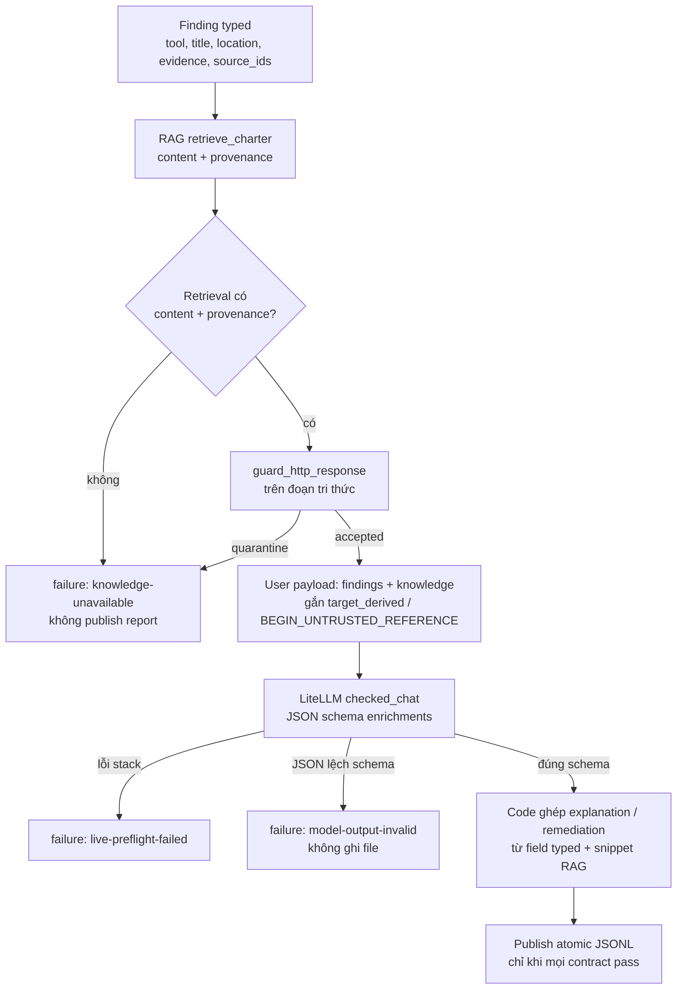

# Charter agent: cách chạy và cách “chứng minh” finding

Bản học một trang (ảnh + 5 bước):
[`assets/showoff/sentinel-beginner-explainer/agent.html`](../../assets/showoff/sentinel-beginner-explainer/agent.html).

Tài liệu này mô tả **agent Charter đã as-built**, không phải Workbench.
Hai câu cần trả lời: agent chạy theo bước nào, và một finding trên report
đứng bằng gì.

Authority: [charter brief](sentinel-charter-brief.md),
[as-built](../sentinel-six-week-as-built-architecture.md),
`agent/recon.py`, `agent/report.py`, `agent/week3_analysis.py`.

**Agent không exploit để chứng minh lỗ.** Finding đến từ scanner đã normalize.
Agent chỉ được kể lại các trường typed + đoạn RAG có provenance. Model không
được thêm location, endpoint, CWE, hay class lỗ mới.

---

## 1. Agent là gì trong Charter

Hai điểm vào, cùng hợp đồng evidence-bound. Đừng gọi `python -m agent.recon`
không flag: đó là Attack Surface Map từ DefectDojo lake, không phải report
Charter.

| Đường | Owner | Input | Output |
|---|---|---|---|
| Tuần 3 (aggregate đã nộp) | `agent/week3_analysis.py` | `artifacts/week1.aggregate.jsonl` + manifest (`week1-submission/v1`) | JSONL `week3-analysis/v1` |
| Live Charter (controller) | `agent/recon.py` → `build_charter_report_from_rag` | sanitized Nuclei JSONL của run | cặp `normalized.jsonl` + `report.jsonl` schema `1.0` |

Cả hai dùng system prompt `agent/prompts/charter-system-prompt.md`.
Lời explanation / remediation do code ghép (`_render_explanation`,
`_render_remediation`): live ở `agent/report.py`, tuần 3 ở
`agent/week3_analysis.py` (cùng mẫu câu).

Tuần 3 nhận 3 tool (Nuclei, Trivy, Semgrep) từ aggregate tuần 2, rồi **gộp
trùng** trước khi gọi model. Live normalize (`agent/normalize_findings.py`)
chỉ nhận Nuclei HTTP đã sanitize về `127.0.0.1:13000`. CI Trivy đi
`agent/normalize_trivy.py` (`tool=trivy`). Semgrep **không** vào schema
live `NormalizedFinding`.

Proposal **không** lấy path từ finding. Chỉ `SAFE_REQUEST_CASES` trong
`agent/charter_requests.py` (6 case, 2 path Charter).

Workbench / syndicate / `$0.05/run` không phải đường này.

---

## 2. Agent chạy như nào



Thứ tự thật:

1. **Normalize trước.** Input hỏng / trống → `empty-input`, `malformed-input`,
   `invalid-record` (tuần 3 thêm `metadata-mismatch` nếu digest/manifest lệch).
   **Không gọi model. Không ghi report.**
2. **Retrieve** (`rag/retrieve.py` `retrieve_charter`). Mỗi item phải có
   `content` + `provenance`. Trống, lệch corpus digest, hoặc
   `guard_http_response` quarantine → `knowledge-unavailable`.
3. **Gọi model** với message đã gắn nhãn: system prompt = operator; findings
   + snippet RAG = `target_derived`. Đoạn tri thức bọc
   `BEGIN_UNTRUSTED_REFERENCE` … `END_UNTRUSTED_REFERENCE`. Schema
   `sentinel_charter_enrichments` (tuần 3: `sentinel_week3_enrichments`).
4. **Code viết lời.** Model không được phép soạn explanation / remediation.
5. **Publish atomic.** Live ghi cặp `normalized.jsonl` + `report.jsonl` cùng
   lúc (`write_jsonl_pair_atomic`). Lệch một phía →
   `artifact-publication-failed`, không để file dở.

Live controller: `scripts/sentinel-demo.sh` stage `analysis-report` gọi

```bash
python -m agent.recon \
  --charter-input <sanitized.jsonl> \
  --charter-normalized-out .sentinel-runs/<id>/normalized.jsonl \
  --charter-report-out .sentinel-runs/<id>/report.jsonl
```

`sentinel-charter-up.sh` chỉ bật topology. Preflight BLOCKED hôm nay là
thiếu stack operator, không phải vì agent không có hợp đồng. **Đừng chạy
`sentinel-demo.sh run` để “chứng minh” tài liệu này.**

Tuần 3 offline (không cần Kong):

```bash
PYTHONPATH=. .venv/bin/python -m agent.week3_analysis \
  --week3-aggregate artifacts/week1.aggregate.jsonl \
  --week3-manifest artifacts/week1.aggregate.manifest.json \
  --week3-report-out /tmp/week3-report.jsonl
```

Sample **synthetic** (placeholder hash, không phải live Juice Shop / live LLM):
`docs/reports/artifacts/week3-sample-report.jsonl`.

Báo cáo offline từ đúng 36 dòng tuần 1 (stub retrieve/model, không LiteLLM):
`PYTHONPATH=. .venv/bin/python scripts/analyze-week1-aggregate.py` →
`docs/reports/artifacts/week1-aggregate-report.jsonl`.

---

## 3. “Chứng minh finding” nghĩa là gì

Một dòng report **chứng minh quan sát máy quét còn đúng trên giấy**, không
chứng minh “lỗ đã khai thác được” và không chứng minh “AI nghĩ vậy”.

Chuỗi bằng chứng:

1. **Scanner** ghi alert. Tuần 1–2: Nuclei + Trivy + Semgrep vào
   `artifacts/week1.aggregate.jsonl` (**36** dòng = 21 Nuclei + 4 Trivy +
   11 Semgrep). Semgrep 11 là Java/WebGoat/OWASP Benchmark, không phải cây
   Juice Shop. DefectDojo lab board (**5** finding) là kho khác. **36 ≠ 5.**
2. **Normalize** thành record typed. Tuần 2/3: `finding_id`, `tool`,
   `scanner`, `title`, `severity`, `location`, `evidence`, `source_id` /
   `source_ids` (`week1-submission/v1`). Live: `NormalizedFinding` schema
   `1.0` trong `agent/charter_contracts.py`.
3. **Provenance** truy ngược file + digest. Ví dụ tuần 2:

   `week1-submission:nuclei:sha256:749fcb54…:item:1`

   Dòng thật đầu tiên của aggregate: title `Public Swagger API - Detect`,
   `location` = `path:/api-docs/swagger.json`,
   `evidence` = `template-id=swagger-api`.
4. **Explanation do code ghép** từ đúng các field đó. Câu live
   (`agent/report.py`):

   > Công cụ {tool} ({scanner VI}) ghi nhận cảnh báo «{title}» tại
   > {location}. Mức độ: {severity VI}. Bằng chứng máy quét (đã qua cổng
   > an toàn): {evidence[0]}. Đây là quan sát từ máy quét trên dữ liệu đã
   > chuẩn hóa; không suy ra endpoint hay lỗ hổng ngoài các trường đã typed.

   Tuần 3 đổi cụm cuối thành “dữ liệu Tuần 1–2 đã chuẩn hóa”.
5. **Remediation** = đối chiếu lại evidence + snippet RAG (có `provenance`)
   + “chỉ lab”. Không phải playbook exploit.
6. **`knowledge_provenance`** trên report: nguồn đoạn tri thức, đã `scrub`
   PII. RAG là dữ liệu, không phải lệnh.
7. **`confidence`** là field duy nhất model được chọn: `low` / `medium` /
   `high`.

Tên file nộp tuần 2 khi nói “36 finding”: `artifacts/week1.aggregate.jsonl`.
Charter **không** có file committed tên `findings.jsonl`.

---

## 4. Model được phép trả gì

System prompt + JSON schema chỉ nhận:

```json
{
  "enrichments": [
    {
      "finding_id": "<id đã có trên finding typed>",
      "explanation_mode": "scanner-observation",
      "remediation_mode": "review-documented-fix",
      "confidence": "medium"
    }
  ]
}
```

Đúng một object / finding. Không thêm location, evidence, endpoint, CWE,
hay class lỗ. `_enrichments` trong `agent/report.py` từ chối mọi key ngoài
bốn field trên; `explanation_mode` / `remediation_mode` phải đúng enum.
Prose không lấy từ model.

Trong git **không có** dump LiteLLM live. Sample tuần 3 là synthetic.
Đừng chiếu file trong `.sentinel-runs/` như bằng commit.

---

## 5. Khi nào agent từ chối (đó cũng là bằng chứng)

Fail-closed: invalid thì **không** để lại report / cặp artifact dở.

| Code | Nghĩa |
|---|---|
| `empty-input` | Không có finding typed |
| `malformed-input` / `invalid-record` | File / JSON / record sanitize hỏng |
| `metadata-mismatch` | Tuần 3: manifest / `aggregate_sha256` lệch |
| `knowledge-unavailable` | RAG trống, không provenance, lệch digest, hoặc IPI quarantine |
| `model-output-invalid` | JSON lệch schema, thừa field, sai mode, thiếu `finding_id` |
| `live-preflight-failed` | LiteLLM / labelled chat không chạy |
| `artifact-publication-failed` | Ghi cặp file atomic thất bại |

Test chứng minh “invent thì không ra file”:

- `tests/test_charter_contracts.py` → `test_model_invention_rejects_all_publication`.
  Model thêm `"location": "http://invented.example/admin"` →
  `model-output-invalid`; `normalized.jsonl` và `report.jsonl` không tồn tại.
- Cùng file: `test_arbitrary_model_vulnerability_prose_is_not_an_allowed_contract_field`
  (mode tự do / class lỗ bịa → reject).
- Tuần 3: `tests/test_week3_aggregate_analysis.py` →
  `test_model_invention_and_output_collision_publish_nothing`.

Đó là cách Charter **chứng minh hợp đồng evidence-bound**, không phải điểm
FP/FN live. Scorecard
`evaluation/charter-eval/charter-evaluation.json` có `live_run: false`.
Pytest offline (slim 338, overlay 140, mentor 102, PII 10/10 FP 0) chứng
hợp đồng trong repo. **Không** nói đó là điểm AI live.

---

## 6. Finding không thành request

Sau report, `agent/charter_proposal.py` chỉ lấy case từ catalog 6 mục,
2 path Charter. `location` của finding không thành path / query / body.
Đó là ranh giới hành động, không phải bước “chứng minh lỗ bằng cách đánh”.

HITL reject: không mint, không gửi. Facade `:18055` gọi cùng hàm, mọi JSON
`sent: false`. Không dùng facade làm điểm AI live.

---

## 7. Mở file nào khi trình bày

| Câu hỏi | File |
|---|---|
| Finding tuần 2 (36 dòng) | `artifacts/week1.aggregate.jsonl` |
| Prompt model được đọc | `agent/prompts/charter-system-prompt.md` |
| Code ghép lời | `agent/report.py` (`_render_explanation`) |
| Schema + fail codes | `agent/charter_contracts.py` |
| Invent → không publish | `tests/test_charter_contracts.py` |
| Report mẫu (synthetic) | `docs/reports/artifacts/week3-sample-report.jsonl` |
| Catalog request | `agent/charter_requests.py` |

---

## 8. Câu được nói / không được nói

Được: agent evidence-bound; explanation do code ghép từ scanner fields;
model chỉ chọn confidence; invent → không publish; 36 finding nằm ở
`week1.aggregate.jsonl`; “chứng minh” = bám phiếu scanner + fail-closed.

Không: agent tự tìm lỗ mới; report = lời ChatGPT; đã exploit để chứng minh;
36 = 5 DefectDojo; Semgrep 11 = Juice Shop; `findings.jsonl` là file Charter;
scorecard `live_run: false` là điểm AI live; `$0.05/run` là Charter.
