# Kiến trúc Sentinel sáu tuần (as-built)

Tài liệu này là bản đồ các ranh giới hiện có để đối chiếu với
[charter sáu tuần](Project_Sentinel_6-week.md). Nó không phải bằng chứng cho
một lần nghiệm thu live hoàn chỉnh. Quy trình vận hành và điều kiện để thực hiện
một lần chạy mới thuộc [live-acceptance runbook](operations/sentinel-live-acceptance-runbook.md).
The separate [Sentinel Security Research Workbench](product/sentinel-security-research-workbench.md)
has its own host-worker, source-egress and experimental-evidence boundary; it
does not extend or complete the Charter topology shown below.

```mermaid
flowchart LR
    scan["Scanner SAST / DAST / SCA"]
    redact["Redaction trước khi lưu"]
    normalized["Finding chuẩn hoá"]
    rag["Kho tri thức RAG"]
    llm["LiteLLM + Security Analysis"]
    report["Báo cáo JSONL có provenance"]
    proposal["Đề xuất request an toàn"]
    hitl{"HITL\nApprove / Reject"}
    executor["Executor do operator quản lý"]
    kong["Kong Gateway"]
    target["Juice Shop\nloopback lab"]
    guard["Response guard + PII redaction"]
    evidence["Manifest + evaluation\nmetadata / digest"]
    audit["Kong audit nguồn vận hành"]

    scan --> redact --> normalized
    normalized --> llm
    rag --> llm
    llm --> report --> proposal --> hitl
    hitl -->|Reject| evidence
    hitl -->|Approve| executor --> kong --> target --> guard --> evidence
    kong --> audit
    audit -. "tham chiếu hoặc digest" .-> evidence

    classDef untrusted fill:#ffe6e6,stroke:#b91c1c,color:#111;
    classDef trusted fill:#e7f5ff,stroke:#0369a1,color:#111;
    classDef operator fill:#fff7d6,stroke:#a16207,color:#111;
    class scan,rag,target untrusted;
    class normalized,llm,report,proposal,guard,evidence trusted;
    class hitl,executor,kong,audit operator;
```

## Ranh giới tin cậy

- **Đầu vào không đáng tin cậy:** kết quả scanner, nội dung RAG và mọi response
  từ ứng dụng là dữ liệu, không phải chỉ dẫn cho model. Điểm vào của model được
  sở hữu bởi [`agent/recon.py`](../agent/recon.py) và đường compatibility Week 3
  bởi [`agent/week3_analysis.py`](../agent/week3_analysis.py); các contract kiểm
  tra của chúng là nơi xác định hành vi chi tiết.
- **Biên model:** system prompt là nội dung do operator kiểm soát; findings và
  tri thức được gắn provenance trước khi gọi LiteLLM. Báo cáo chỉ được xuất bản
  qua các contract của đường Charter, thay vì coi văn bản model là sự thật độc
  lập.
- **Biên hành động:** proposal không tự tạo quyền gọi ứng dụng. Chỉ HITL tạo
  quyết định approve/reject; executor là ranh giới operator riêng, còn Kong
  thực thi xác thực và allowlist. Chính sách chi tiết thuộc
  [`agent/charter_requests.py`](../agent/charter_requests.py),
  [`scripts/sentinel-charter-executor.py`](../scripts/sentinel-charter-executor.py)
  và [Kong](../infra/kong/README.md).
- **Biên bí mật và bằng chứng:** controller/agent không sở hữu secret executor.
  Sentinel không persist response thô hay audit Kong thô trong artifact/bằng
  chứng theo dõi: response không đi vào LLM, còn evidence chỉ giữ tham chiếu
  hoặc digest theo runbook. [`scripts/sentinel-manifest.py`](../scripts/sentinel-manifest.py)
  là owner của manifest và kiểm tra trường nhạy cảm.

## Các đường chính và owner

| Mục tiêu charter | Điểm vào/owner thực thi |
| --- | --- |
| Quét, redaction và chuẩn hoá | [`scanners/`](../scanners/), [`agent/normalize_findings.py`](../agent/normalize_findings.py), [`scripts/scan-and-import.sh`](../scripts/scan-and-import.sh) |
| Tra cứu và phân tích | [RAG](../rag/README.md), [`agent/recon.py`](../agent/recon.py), [`agent/report.py`](../agent/report.py) |
| Proposal và phê duyệt | [`agent/charter_proposal.py`](../agent/charter_proposal.py), [`agent/charter_approval.py`](../agent/charter_approval.py) |
| Gửi request qua gateway | [`agent/charter_requests.py`](../agent/charter_requests.py), [Kong](../infra/kong/README.md), [`scripts/sentinel-charter-executor.py`](../scripts/sentinel-charter-executor.py) |
| Guardrails và redaction response | [`agent/charter_response_guard.py`](../agent/charter_response_guard.py), [`agent/pii.py`](../agent/pii.py) |
| Điều phối, manifest và đánh giá | [`scripts/sentinel-demo.sh`](../scripts/sentinel-demo.sh), [`scripts/sentinel-manifest.py`](../scripts/sentinel-manifest.py), [`evaluation/charter-eval/`](../evaluation/charter-eval/) |

## Phạm vi và trạng thái bằng chứng

- Target được cấp phép là Juice Shop trên loopback; gateway và executor không
  mở rộng quyền sang target bên ngoài. Các giới hạn request an toàn và điều kiện
  dừng thuộc runbook, không thuộc sơ đồ này.
- Contract, unit test và các suite offline xác minh thành phần có thể tái lập.
  Chúng không thay thế một lần acceptance mới có cùng run ID, quyết định HITL,
  evidence Kong, báo cáo cuối và evaluation hiện hành.
- Đường live đầy đủ vẫn là công việc vận hành có điều kiện. Khi executor có kết
  quả `unknown`, không retry hay suy diễn receipt từ audit. Recovery audit-only
  đã được triển khai cho trạng thái durable phù hợp, nhưng chỉ cho kết quả
  `recovered`; nó không thay thế receipt bình thường, response guard, báo cáo
  cuối, evaluation hoặc acceptance live theo runbook.
